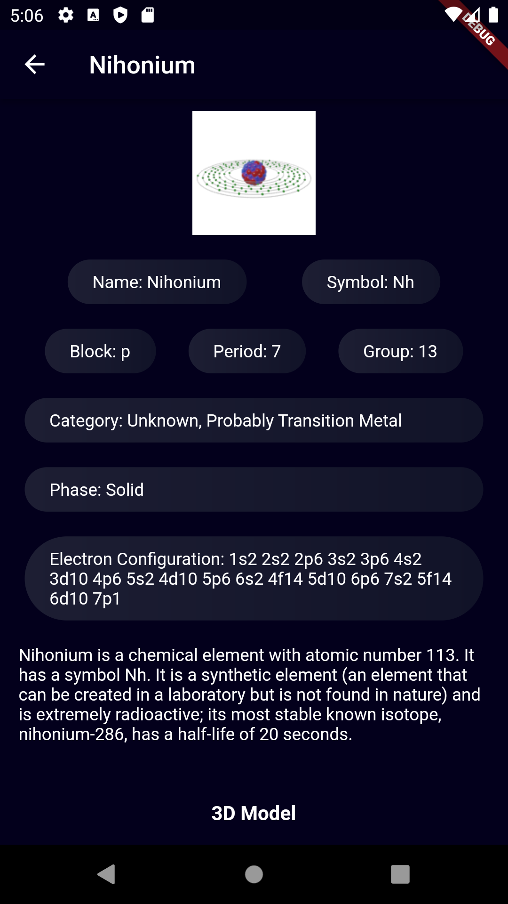
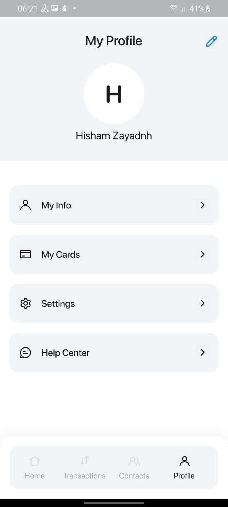
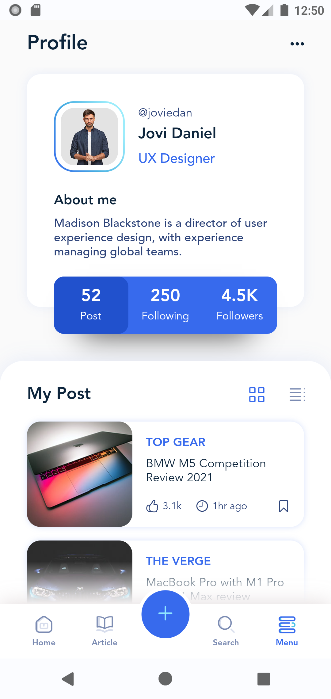

# 基于 Flutter 的高仿「京东」

> [「京东」](https://app.jd.com/)京东客户端

> 支持设备: Android 4.1+ and iOS 9.0+

## 声明

该 APP 所用到的 API 均由 [「京东」](https://app.jd.com/)提供，[本人](https://github.com/ZYHB)采取非正常手段获取。获取跟共享的行为或许有侵犯权益的嫌疑。请您了解相关情况，并保证不侵犯[「京东」](https://app.jd.com/)的利益，并遵守开源协议

## 项目描述

1. 基于 GetX 框架开发，能同时运行在 Android、iOS、Web 环境下
2. 到目前为止，该项目均由本人独立完成。实现了[「京东」](https://app.jd.com/)较为常用的功能点.
   以下是功能列表

- 登录页面（内容比较简单）
- 浏览历史页面（上拉加载、下拉刷新）
- 新品页面（内容比较复杂）
  - 瀑布流
    waterfall_flow: ^3.0.2
  - 强大的 Sliver 扩展库
    extended_sliver: ^2.1.3
  - 扩展 NestedScrollView
    extended_nested_scroll_view: ^6.1.2
  - 加载更多列表支持 ListView,GridView 以及瀑布流。
    loading_more_list: ^6.0.0
- 账户设置页面
- 我的订单页面
- 我的页面
- 发现页面
- 分类页面
- 引导页面
- 闪屏页面
- 商品详情页面
- 首页页面
- 购物车页面

## 接口文档

json 文件内置到工程中

## Web

web 产物在`ts-pages`分支可查看。
[查看运行效果](https://miaopasiflutter.github.io/AwesomeProject/#/index)

## Android


[JD-Android-V0.1 下载地址](https://www.pgyer.com/1lJA)

## iOS

无苹果开发者账号, 暂时无法打包 APP, 请亲自进行编译并在模拟器或手机上运行

## 截图

## 仿京东 APP 截图


## [一款开源的音乐播放器应用程序！](https://github.com/Sangwan5688/BlackHole)

     

## [一个通过手机记录学生的出勤情况，并生成文本或图像形式的报告的 APP。](https://github.com/rashidwassan/muet-attendance-taking-app)


## [一个美食中心 APP](https://github.com/radensaleh/FoodHub-App)


## [一个壁纸的 APP](https://github.com/barandenizdogan/OORBSWALLPAPER)


## [一个个人博客类 UI 的 WEB & APP](https://github.com/david-legend/nimbus)


## [一款健身应用的 UI 模板 APP](https://github.com/HypeTeqSoftware/FitnessApp)


## [一款元素周期表及元素 3D 模型的 APP](https://github.com/berkayceylan/periodic_table_flutter)



## [一款计划｜待办事项的 UI 模板 APP](https://github.com/Abdelrahman-Rashad/To-Do-Flutter)


##### Flutter 精美 UI 截图

- 一款游戏《无畏契约》资料的 UI 模板 APP


- 一款收付款和记账本的 UI 模板 APP
  

- 一款智能家具应用的 UI 模板 APP

  

- 一个美食评价打分的 APP

  

- 一个基于 GetX 的 Dashboard 纯 UI 界面自适应手机、平板、web 的模板 APP


- 一个包含动画，收藏，删除和切换主题等功能 UI 的邮件类 APP


- 一个博客论坛的 APP

  

- 一个仿 Facebook UI 的 APP

  

- 一个仿 Instagram UI 的 APP

  

- 一个在线订票的 APP

  

- 一个日常费用和财务管理的 APP

  

- 一个商城购物 APP

  

- 一个旅行类的 APP

  

- 一个在线聊天简单 UI 的 APP

  

- 使用 Rive 和 Flutter 的动画应用程序

  

- Flutter 电子商务移动应用模板

  
  
  

- 模拟时钟明暗主题

  

- 做题效果

  

- 视差动画效果

  
  

- 响应式效果 1

  

- 响应式效果 2

  
  
  
  

- 音乐播放器效果

  

- 手机罗盘效果

  

- 其他

  
  
  
  
  

## 整体思路

1. 分析「京东」App 的业务逻辑结构，将整体业务按重要程度进行划分，安排整体开发流程
2. 在 Mac 环境下使用 Charles 软件抓包，抓取「京东」的网络接口数据，并整理接口
3. 使用 GetX 开发项目

## 目前所发现的 bug 以及尚未完成的功能点

### Android

### iOS

### 共同问题

## 将来也许会做的功能点

1. 搜索
2. 音频视频缓存
3. javascript 热更新
4. 收藏
5. ......

## Build

## 第三方库

```

# 一个强大的 HTTP 网络包，支持拦截器、中止和取消请求、自定义适配器、转换器等。
dio: ^5.3.2
# 用于获取主机平台文件系统上的常用位置，例如临时目录和应用程序数据目录。
path_provider: 2.1.1
# 用于查询应用程序包的信息，例如iOS上的CFBundleVersion或Android上的versionCode。
package_info_plus: 4.1.0
# 相机
wechat_camera_picker: 4.0.2
# 相册选择
wechat_assets_picker: 8.7.1
# 图片加载
extended_image: 8.1.0
# 图片文件流
extended_image_library: 3.6.0
# 加载动画
flutter_easyloading: 3.0.5
# 获取app 权限
permission_handler: 10.4.2
# 屏幕适配
flutter_screenutil: 5.8.4
# 拖拽
reorderables: 0.6.0
# 刷新控件
easy_refresh: 3.3.2+1
# 本地数据存储,不涉及到系统读写权限
shared_preferences: 2.2.0
# 图片选择
image_picker: 1.0.0
# 状态管理、路由
get: 4.6.6
# 该包包含预制动画，可实现常见的所需效果
animations: ^2.0.8
# 基于Flutter Canvas 绘图思想实现的图表功能，支持饼状图、柱状图、拆线图
flutter_echart: ^2.0.0
# 一个 Flutter 插件，用于为提供的小部件实现液体滑动效果。
liquid_swipe: ^3.1.0
# 抖动动画、向上弹出动画、抖动文本、垂直圆形菜单、底部圆形菜单、动画进度按钮
shake_animation_widget: ^3.0.4
# 用于轻松创建 Matrix4 转换的辅助数学类，您可以在容器的转换参数和其他地方使用它。
matrix4_transform: ^2.0.1
# 在 Flutter 上原生渲染 After Effects 动画.
lottie: ^2.6.0
# 一个新的 Flutter 对话框，带有一系列精美的动画，滑动、淡入淡出、旋转、大小、缩放、旋转 3D 动画。
flutter_animated_dialog: ^2.0.1
# 一个提供下拉刷新和上拉加载的flutter widget。
easy_refresh: ^3.3.2+1
# 瀑布流
waterfall_flow: ^3.0.2
# 强大的Sliver扩展库, 包括 SliverToNestedScrollBoxAdapter, SliverPinnedPersistentHeader,
# SliverPinnedToBoxAdapter 和 ExtendedSliverAppbar.
extended_sliver: ^2.1.3
# 扩展NestedScrollView
extended_nested_scroll_view: ^6.1.2
# 加载更多列表支持ListView,GridView以及瀑布流。
loading_more_list: ^6.0.0
# 一个纯粹的flutter toast库，支持自定义样式/小部件，轻松实现与原生toast相同的效果。
oktoast: ^3.3.1
# 一个漂亮的flutter应用程序版本更新对话框。您可以自定义自己的版本更新弹窗！
flutter_update_dialog: ^2.0.0
# 一个轮播滑块小部件，支持无限滚动和自定义子部件。
carousel_slider: ^4.2.1
# Flutter 的地理定位插件。  该插件为通用位置（GPS 等）功能提供跨平台（iOS、Android）API。
geolocator: ^10.0.0
# 使用 Dart Streams 来解耦应用程序的简单事件总线
event_bus_plus: ^0.6.1
# 自定义下拉刷新动画.
pull_to_refresh_notification: ^3.1.0
# webview
webview_flutter: ^4.2.3
#
url_launcher: ^6.1.12
# 瀑布流
flutter_staggered_grid_view: ^0.7.0
# 提供国际化和本地化设施，包括消息翻译、复数和性别、日期/数字格式和解析以及双向文本。
intl: ^0.18.1
#
liquid_pull_to_refresh: ^3.0.1


```
